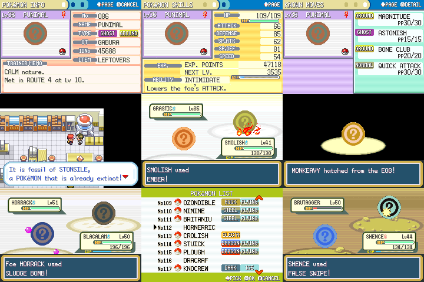

# pokegen: randomized pokémon adventure

A little program that generates Pokémon procedurally and inserts them into Pokémon FireRed using the [pret/pokefirered](https://github.com/pret/pokefirered/) decompilation project.

## Usage

* First, clone [pokefirered](https://github.com/pret/pokefirered/) and follow the steps so that you can compile it.

* Run `pokegen.py` with the path to the `pokefirered` folder. Example:

`./pokegen.py ../pokefirered/`

This generates two files: `dex.json`, used in the next step, and `dex.txt`, a human-readable description of the generated Pokémon.

The script will print out the amount of fully evolved Pokémon by type. If the distribution of types is bad, you can rerun the program a few times until you get a better one.

* Run `replace_files.py` with the path to the `pokefirered` folder. Example:

`./replace_files.py ../pokefirered/`

This will edit the files in `pokefirered`. The script will print two lists: `unavailable families now`, which lists Pokémon families that can't be found in the wild, and `final unavailable families`, which lists Pokémon that can't be obtained at all after gifts and trades have been set. If the latter is not empty, rerandomize by running `replace_files.py` again.

* Compile `pokefirered`. Play the `.gba` file with any emulator.

## Q&A

### Gameplay

**What is missing?**

As you can see from the picture, there are no sprites (though the question mark icons give some kind of suggestion about the colors the Pokémon might be). Dex entries are also not in. The script of the game isn't edited, so everybody talks about weird, nonexistent Pokémon like Bulbasaur. Apart from that, all important gameplay stuff is there: 151 random Pokémon exist with customized stats, moves, evolution data, etc. and trainers have teams that make sense.

**How many Pokémon are obtainable?**

All 151. The starters can be bought at the Game Corner and Mew roams after the postgame is completed, replacing the legendary beasts. Sevii Islands don't contain any additional Pokémon but some species will probably only be found there.

**How balanced is the game?**

Not very. The program doesn't have any kind of real understanding how "good" any Pokémon or move is; it relies on heuristics like BST or base power to approximate. During my test playthrough, the feeling I got was that the game was probably slightly easier than the real thing.

**What is this Pokémon even?**

As there are no sprites, it can be pretty difficult to figure out what the Pokémon are supposed to be like. `dex.txt` contains debug data you can check out to see what the script was thinking of when generating the Pokémon. However, I think making up your own interpretations is a big part of the fun.

### Technical questions

**I got a compile error with `pokefirered`?**

If the developers of that project change stuff, it may break some things here. The last time I checked that this program works was with [this commit](https://github.com/pret/pokefirered/commit/4c023cb8c7fb6e5e8f13867b39c3fbb9f7e7b6b1) of `pokefirered`; use `git checkout` to return to if it you encounter issues.

**How are the Pokémon generated?**

The gist is that the program has a database of *archetypes* (see `archetypes.json`), like `strong_body`, `humanoid_psychic` and `crab`. Each archetype contains moves, abilities and other stuff the Pokémon may have as well as data about additional applicable archetypes.

For example, in one run of the program, the Grass-type starter was "Turowt", some kind of Grass/Ground-type mouse Pokémon with the archetypes `'basic_body', 'muddy', 'ground_animal', 'natural_powers', 'fast_body', 'grass_elemental', 'ground_elemental', 'murine', 'tailed', 'general_animal', 'boney', 'fanged', 'clawed', 'animal_noises'`. You can see it has some basic attributes that you could expect from a mouse Pokémon (`tailed`, `clawed`), elemental attacks (`grass_elemental`, `ground_elemental`) and some more specific themes (`boney` (has access to Cubone's bone moves), `muddy` (has mud attacks)).

As you can imagine, it gets a lot more complicated. Study the source code to find out more if you can understand it at all.

**Can I mod this?**

Feel free to. The code is pretty bad though lmao, I mostly think of this as a proof-of-concept.
